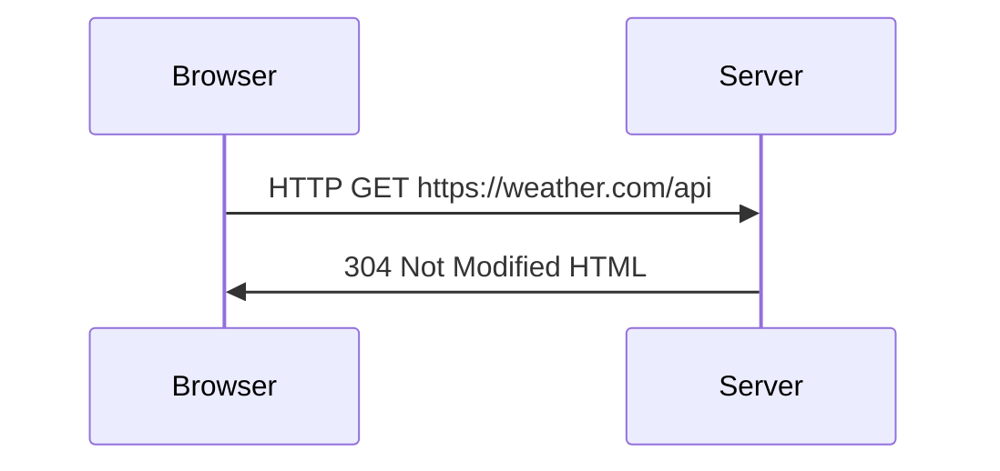

# Backend course

## HTTP, DNS IPs & Networks

- Las computadoras siguen reglas de comunicacion llamados protocolos __(HTTP / HTTPS)__.
- El servidor __DNS__ (Domain Name Server), traduce nombres de dominio (como google.com) en direcciones IP.
- La direccion __IP__ (Internet Protocol) es un numero unico que identifica cada dispositivo conectado en una red.

## APIs (Application Programming Interface)



> La API se encarga de solicitar los datos del tiempo y de llevarlos desde el servidor como respuesta hacia el cliente (Navegador web).

### CRUD

Estructura que sigue la API para gestionar y manipular recursos u objetos.

- Create
- Read
- Update
- Delete

### Metodos HTTP

- __GET:__ Obtener datos
- __POST:__ Crear nuevos recursos
- __PATCH:__ Actualizar un atributo de un recurso
- __PUT:__ Actualizar un recurso completamente
- __DELETE:__ Eliminar un recurso

### Endpoints

URL que representa un recurso o accion especifica.

- GET `/users` -> Obtener el listado de todos los usuarios
- POST `/users` -> Crear un nuevo usuario
- PUT `/users/{id}` -> Actualizar un usuario especifico
- DELETE `/users/{id}` -> Eliminar un usuario especifico

### Encabezados (Headers)

Contienen informacion adicional (metadatos) sobre la solicitud o una respuesta

```http
{
  "Content-Type": "application/json",
  "Authorization": "Bearer <token>",
  "Accept": "application/json",
  "User-Agent": "Mozilla/5.0",
  "Cache-Control": "no-cache",
  "X-Request-ID": "12345"
}
```

### Cuerpo de una solicitud (Request Body)

El cuerpo de una solicitud suele estar en formato JSON, y se utiliza para cuando se crea o se actualiza un recurso.

```json
{
  "name": "John Doe",
  "email": "john@gmail.com"
}
```

### Cuerpo de respuesta (Response Body)

Contiene los datos que el servidor envia como respuesta tras procesar la solicitud.

```http
GET /users

[
  {
    "name": "John Doe",
    "email": "john@gmail.com"
  },
  {
    "name": "Mike Wozowski",
    "email": "mike@gmail.com"
  }
]
```

### Codigos de estado

Codigo entregado por el servidor al cliente una vez se ha proceso la solicitud.

- __200 OK:__ Solicitud exitosa
- __201 CREATED:__ Nuevo recurso creado
- __400 BAD REQUEST:__ La solicitud no es valida
- __404 NOT FOUND:__ El recurso no existe
- __500 SERVER ERROR:__ Error ocurrido en el servidor

## Tipos de APIs

### RESTful APIs

Siguen un enfoque en el cual los clientes interactuan con recursos URLs (por ejemplo `https://api.example.com/users/1`) utilizando metodos HTTP estandar (`GET`, `POST`, `PUT`, `DELETE`).

### GraphQL APIs

Permite a los cliente solicitar exactamente los datos que necesitan

> Cliente -> `GET user-1 age` -> Servidor
